

<h1>osTicket Lifecycle / System Simulation </h1>

<h2>About this Project</h2>

This project builds on a previous osTicket configuration lab by simulating a full ticket lifecycle in a realistic IT support environment. Using the previously configured departments, roles, and permissions, the scenario follows a business-critical outage from the moment a user submits a ticket through triage, escalation, and final resolution. The project highlights key help desk practices such as SLA prioritization and proper escalation procedures.

<h2>Prerequisites, Environment & Technology Used</h2>

- Microsoft Windows Virtual Machine 
- Remote Desktop
- osTicket
- Admin/Analyst Login Page:
     http://localhost/osTicket/scp/login.php
- End Users osTicket URL:
     http://localhost/osTicket

<h2>Getting Started</h2>

<h3>Credentials and Scenarios</h3>

A ticket was created by a User(Karen) stating that their entire mobile/banking system is down. The ticket is viewed by John (Read-only Agent) for triaging. Jane(Admin) then sets the ticket's properties(SLA's/Dept. etc), and after resolving the ticket, Jane proceeds to closing it.

- Password: Password1
- User: Karen
- Agent: John
- Admin: Jane
- Issue: Entire mobile/online banking system is down.

<h3>Ticket Lifecycle stage 1: Creating a ticket.</h3>

- To create a ticket, open Support Center page / End User URL http://localhost/osTicket then click Open a New ticket.

   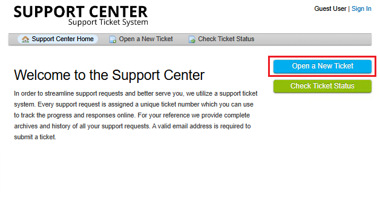

- Enter the User's information, Help Topic, Summary, the Details for openning the ticket, and click Create Ticket.

   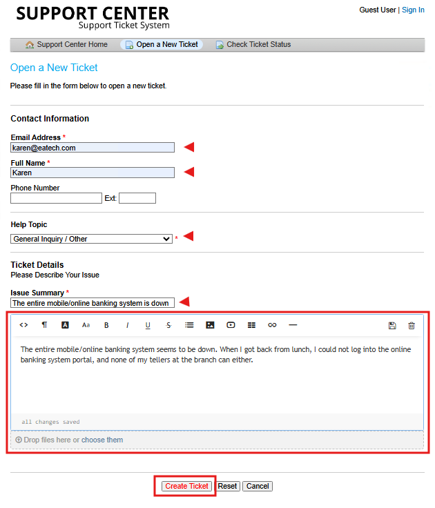

- Ticket successfully created. Observe that a new ticket is showing under Agent/Admin Panel > Tickets.

   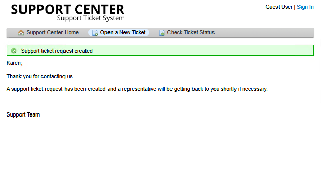
   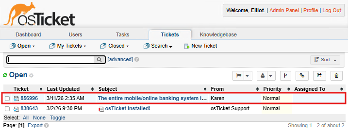   

<h3>Ticket Lifecycle stage 2: User Permissions and Observing/Triaging/Escalating tickets</h3>

To view the created ticket as an Agent, login to the  portal  http://localhost/osTicket/scp/login.php as Agent John.
As you can see, John cannot edit or make any altercation to the ticket. This is because from the previous Lab we Created John as a Read-Only User.

   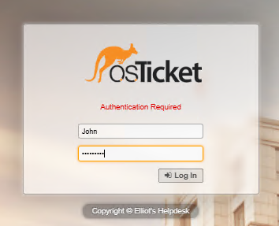
   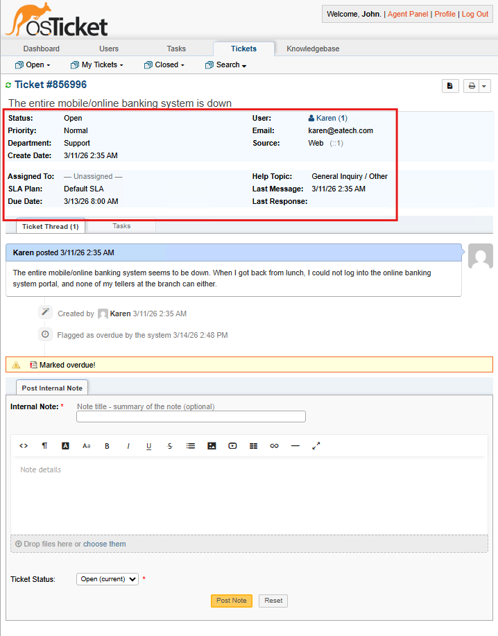

- To give John Permission, Logout from the system and Log back in as an Administrator.
- Go to Admin Panel > Agents > Select John Doe > Access Tab > Change Support Access from View only to All Access.
- After clicking the Save button, it will then show that you have successfully change John's Permission.

   
   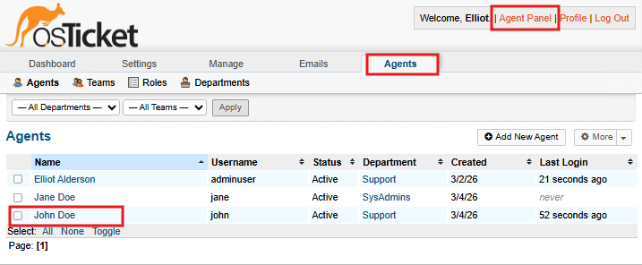
   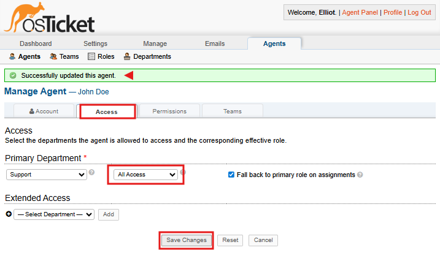
   
- Let's logout from the system again and log back in as John to make some changes on the ticket.
- John is now able to make changes to the ticket. Let's start triaging and editing the ticket. Follow and set the ticket details below:
  
    - Priority: Emergency (Reason: Called end user to confirm, all teller systems are down as of today.)
    - SLA Plan: Sev-A (Reason: Business Critical.)
    - Help Topic: Business Critical Outage (Reason: Entire Branch banking system is offline.)
    - Notate the ticket/Post a Reply saying: Escalating to SysAdmin depoartment after triaging ticket. 
      
      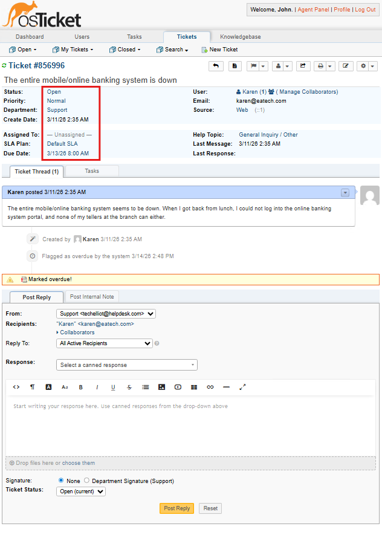
      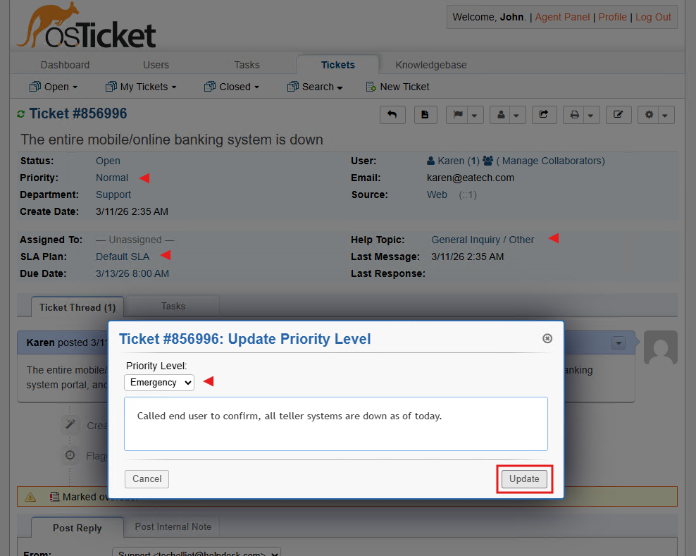
      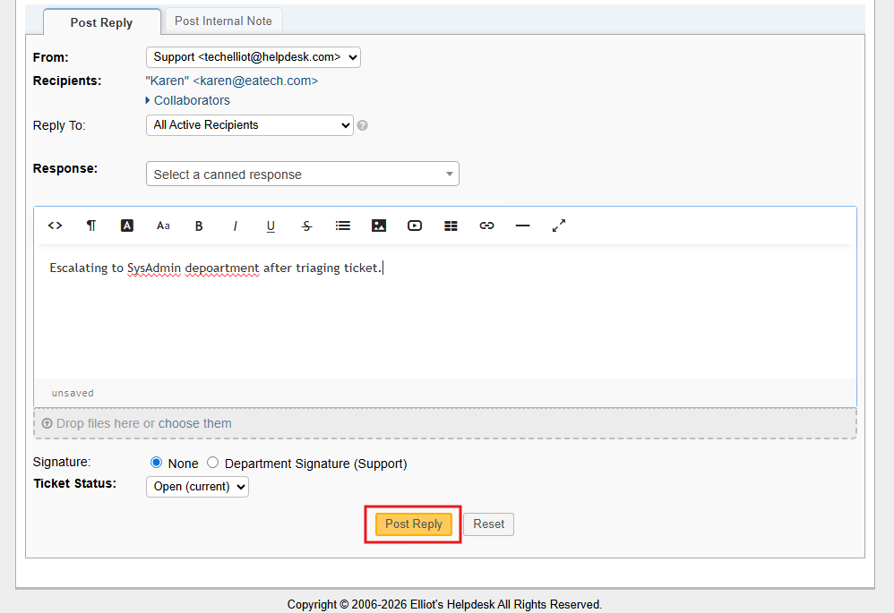
   
   *Notice that all ticket modification made is logged under Ticket Thread.*
   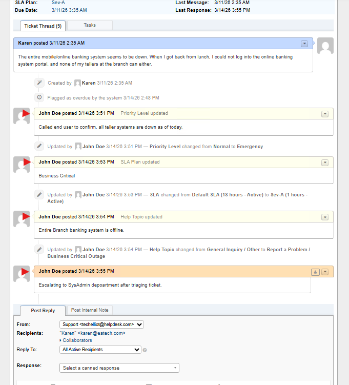

- Escalating the ticket to the Jane Doe at the SysAdmin Department. *Escallation happens if the agent has no ar has limited permissions*
- To escalate the ticket, Select the Assigned To and Department.

   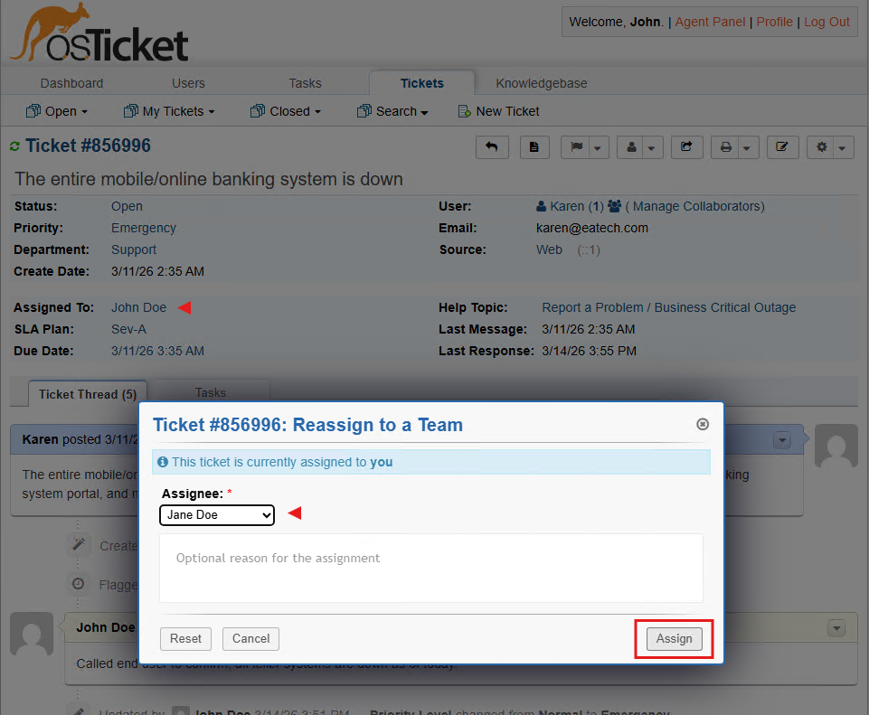
   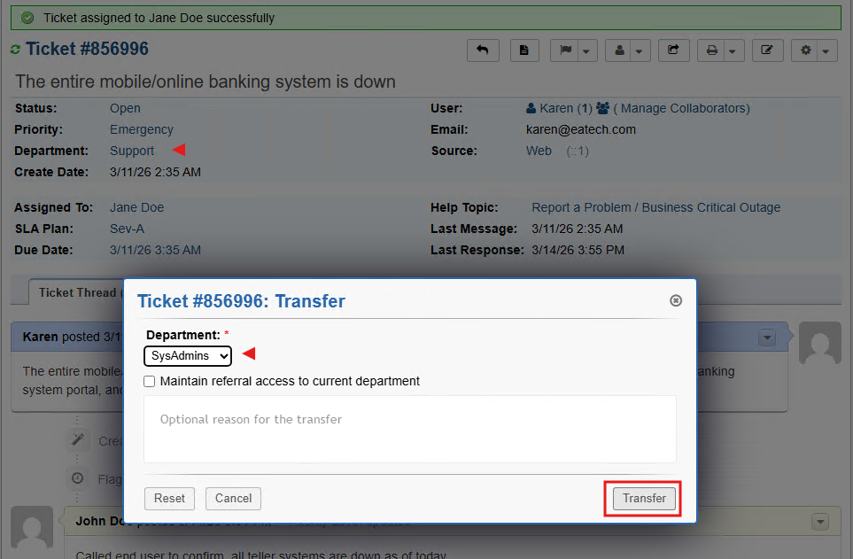

   *This error pops-up since we have escalated the ticket to a Department the John is not a port of. Logout and log back in as a System Administrator (Jane)* 
   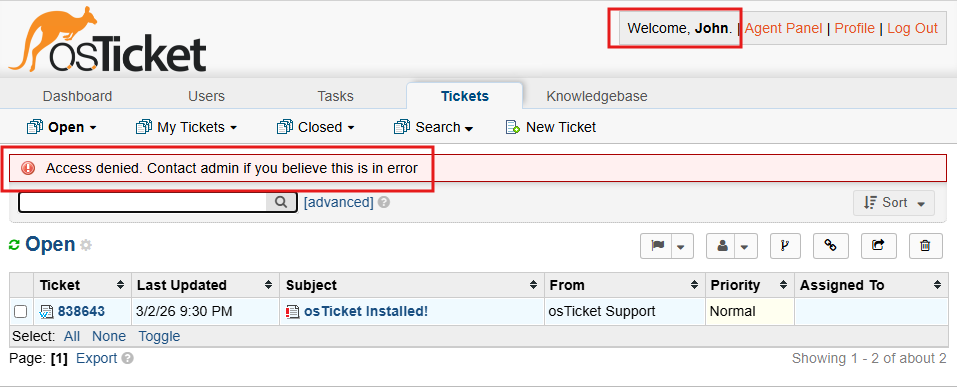

   <h3>Ticket Lifecycle stage 3: Closing a ticket</h3>
   
  In this scenario, the ticket was escalated to the System Administrator(Jane), then she provides solution/reason to the ticket and closed it afterwards. Follow the steps below on how to close a ticket.
   
   - Login as the System Administrator, then notate the ticket stating the reason why the online banking system went down.

     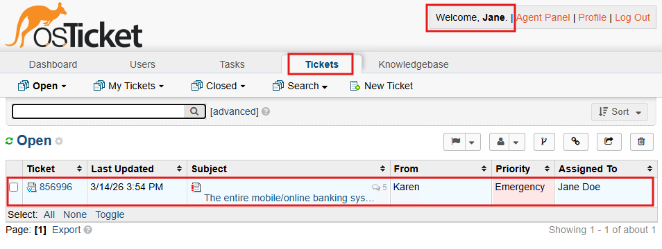
     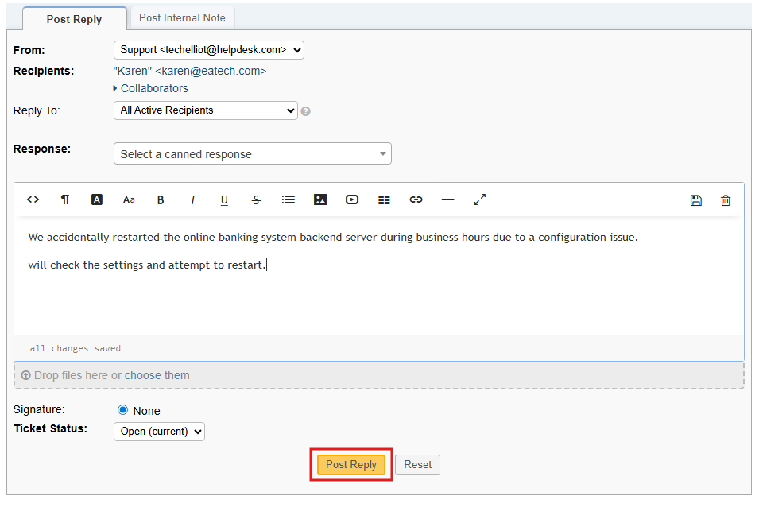

     *At this point  the server has been restarted providing solution for the ticket.*
   - After solving the issue, notate the account again and close the ticket by changing the Status to Closed.

     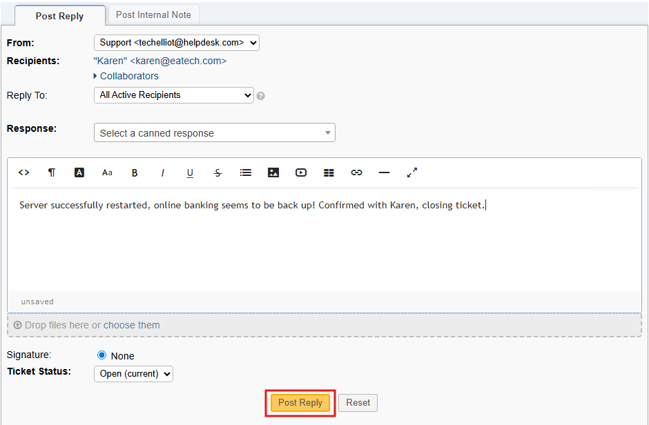
     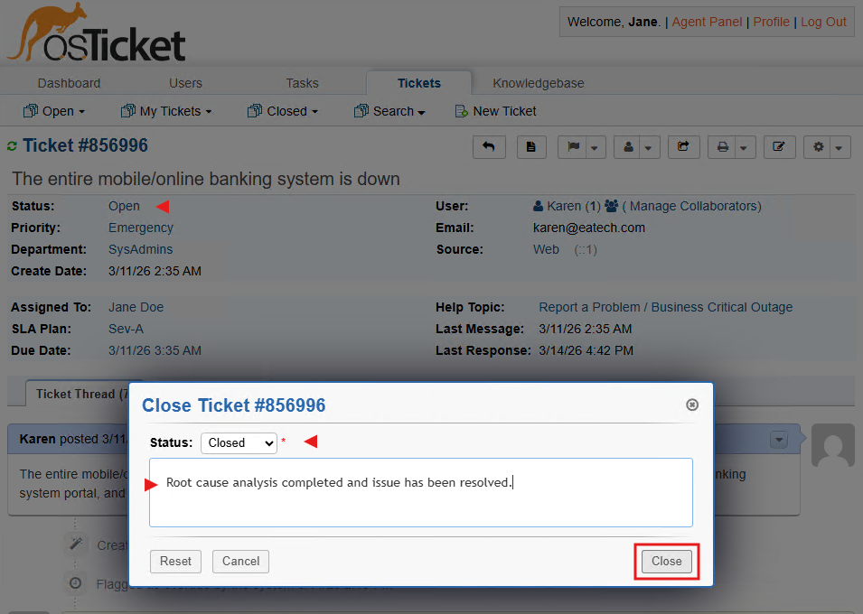
     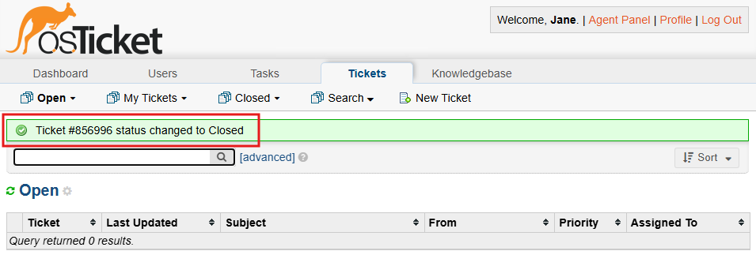

<h2>Finishing Up</h2>

<h3>Congratulations for completing the osTicket Ticket Lifecycle / System Simulation.</h3>

*Having issues and trouble with this Lab Project? Please reach out to easy.patch3668@fastmail.com*

             
              
